# Instructions Connection MySQL vers HIVE via Nifi 

## Prerequis
Avoir completer :
* [installs/Apache Nifi](https://github.com/kkn1ttz/TP-M/tree/master/installs/Apache%20Nifi)

## Mise en place intiale
- Telecharger et placer le driver `mysql` pour nifi

```
cd /opt/nifi
wget https://repo1.maven.org/maven2/com/mysql/mysql-connector-j/8.3.0/mysql-connector-j-8.3.0.jar
mv mysql-connector-j-8.3.0.jar lib/
```

- Copier les fichiers de configurations de HDFS dans Nifi
```
cp /usr/local/hadoop-3.3.6/etc/hadoop/core-site.xml /opt/nifi/conf
cp /usr/local/hadoop-3.3.6/etc/hadoop/hdfs-site.xml /opt/nifi/conf
```

### Creer un repertoire pour acceuillir le resultat de Nifi dans Hive
- Lancer HDFS
```
start-dfs.sh
```

- Creer un repertoire dans HDFS et configurer les permissions
```
hdfs dfs -mkdir -p /user/hive/warehouse
hdfs dfs -chmod 1777 /user/hive/warehouse
```

## Mise en place MySQL
- Entrer dans la console `MySQL`
```
sudo mysql
```

#### Dans la console `mysql>`
- Creation d'un utilisateur pour nifi
```
CREATE USER 'nifi'@'localhost' IDENTIFIED BY 'nifiPW';
GRANT ALL ON nifi_test.* TO 'nifi'@'localhost';
FLUSH PRIVILEGES;
```

- Creation d'une base de données de test
``` 
CREATE DATABASE nifi_test;
USE nifi_test;
``` 

- Creation d'une table de test
```
CREATE TABLE people (
    id INT PRIMARY KEY AUTO_INCREMENT,
    first_name VARCHAR(50),
    last_name  VARCHAR(50),
    city       VARCHAR(50)
);
```

- Insertion de donnees de test
```
INSERT INTO people (first_name,last_name,city) VALUES
  ('Ada','Lovelace','London'),
  ('Grace','Hopper','New York'),
  ('Linus','Torvalds','Helsinki');
```

- Quitter la console `mysql>`
```
QUIT;
```

## Partie Nifi
- Lancer `Apache Nifi` dans la VM
```
/opt/nifi/bin/nifi.sh start
```
> `restart` si deja lancer

- Naviguer vers [http://localhost:8080/nifi](http://localhost:8080/nifi) sur votre navigateur
- Click droit sur le `canvas` (grand espace blanc) et choisissez `configure`

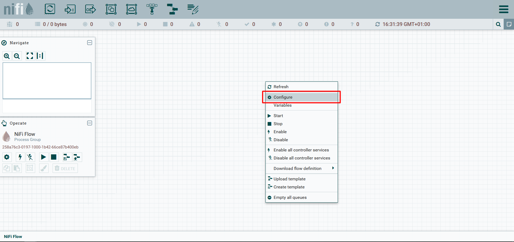

- Allez dans l'onglet `Controller Services` et clicker sur l'icone `+`.

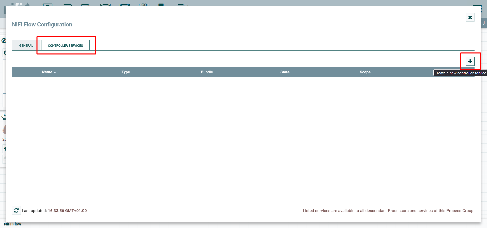

- Recherchez `dbcp` et choisissez `DBCPConnectionPool` et clicker sur `ADD`.
> Lorsque l'on parle de creer un service, reproduire cette action 

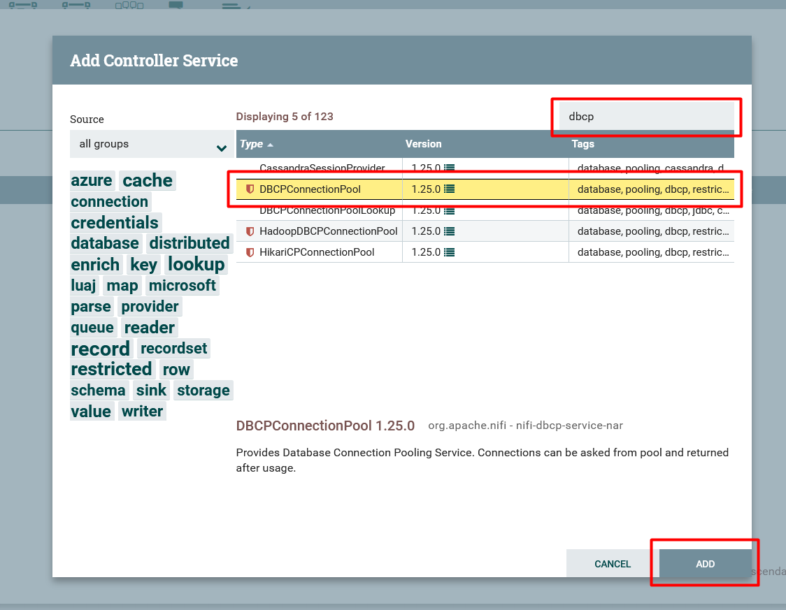

- Remplissez les `properties`

    - `Database Connection URL`=  jdbc:mysql://localhost:3306/nifi_test?serverTimezone=UTC&useSSL=false
    - `DB Driver Class Name`=  com.mysql.cj.jdbc.Driver
    - `Database User`=  nifi
    - `Password`=  nifiPW

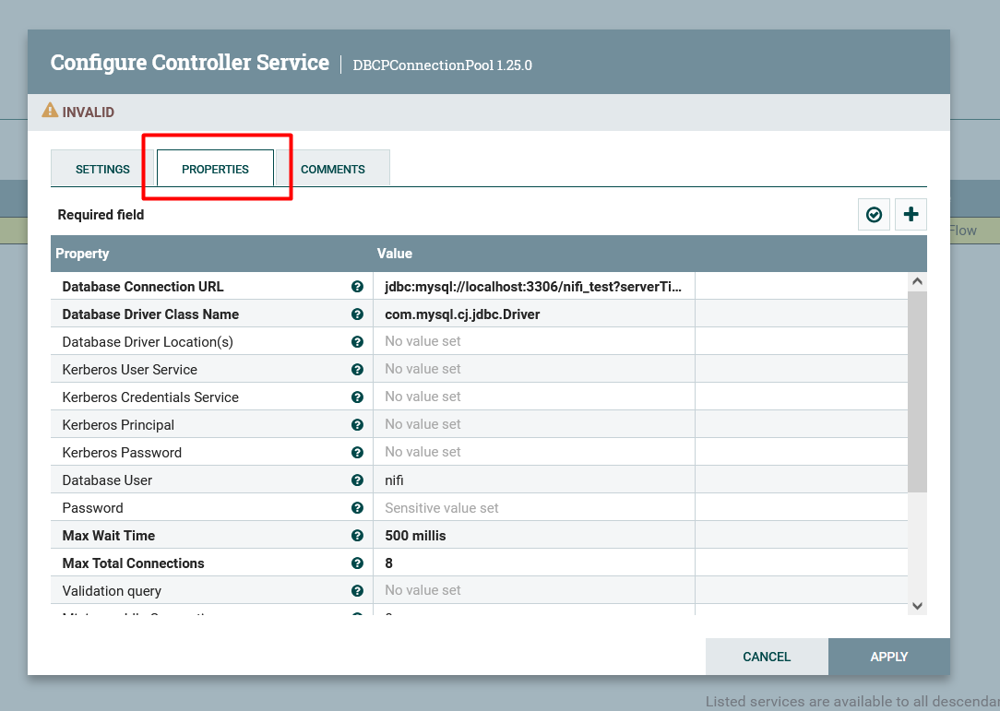

- Clicker sur l'icone d'eclair pour `Enable` le service

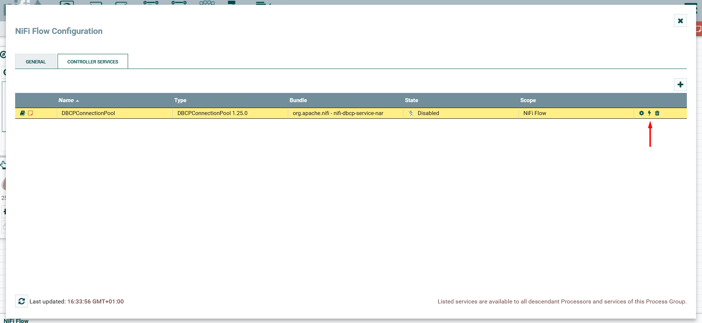

- Revenir au `Canvas` et en haut à gauche clicker sur `processor` sans relacher le click `drag` vers le canvas 
> Lorsque l'on parle d'ajouter un processor, reproduire cette action 

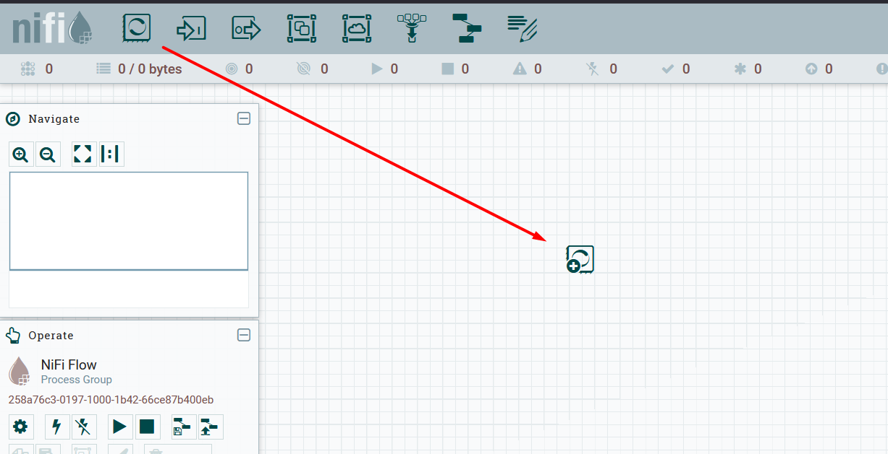

- Ajouter un processor `QueryDatabaseTable`

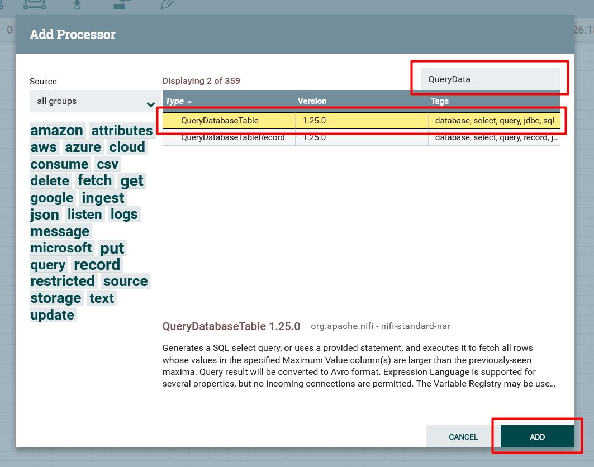

- Configurer le processor
    - `DBCP Service` = le Controlleur Service creer precedement
    - `Table Name` = people
    - `Maximum-value Columns` = id

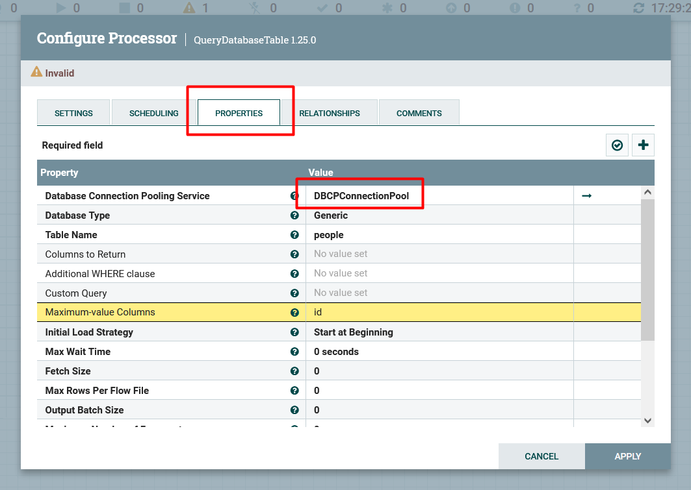

- Ajouter un processor `ConvertRecord` pour convertir le output en CSV

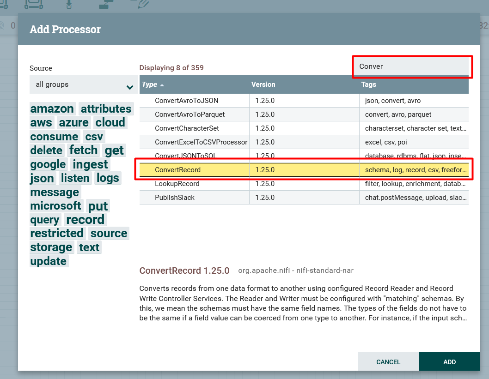

- Configurer `ConverRecord`. Choisissez `Create new service` pour les proprietes `Record Reader` et `Record Writter`. Reproduire comme sur l'image en dessous 

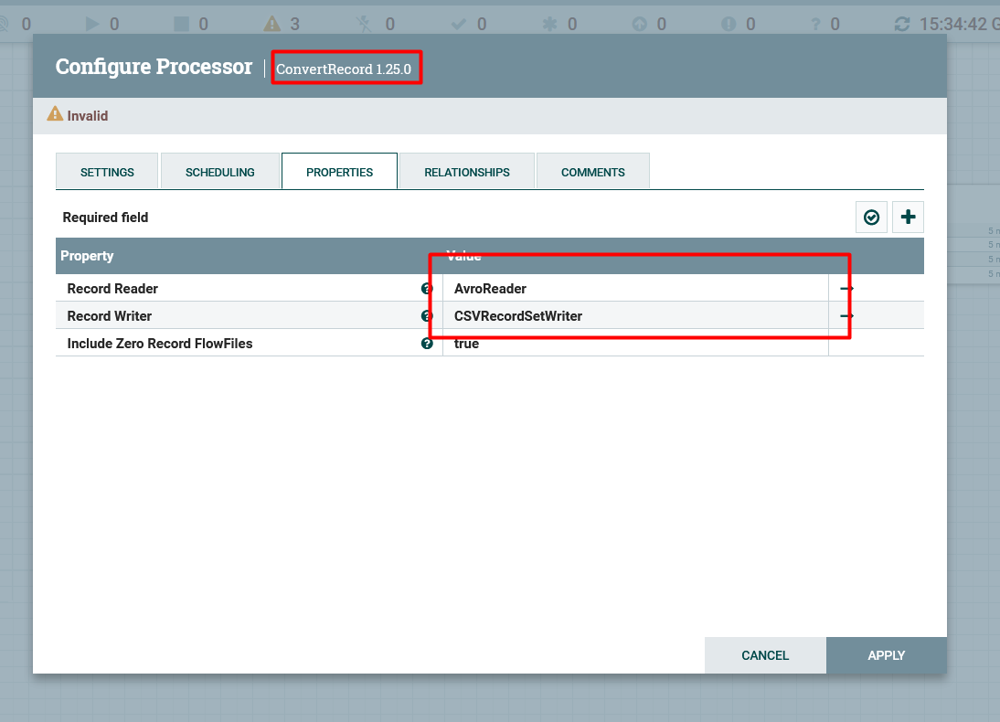

- Puis `Enable` les deux services creer precedement 

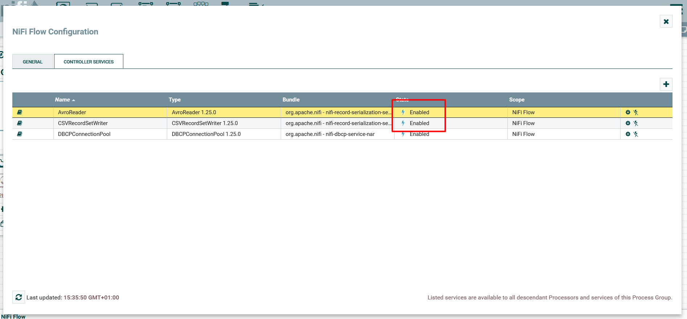

- Rajouter un processor `PutHDFS` et configurer comme sur l'image en dessous

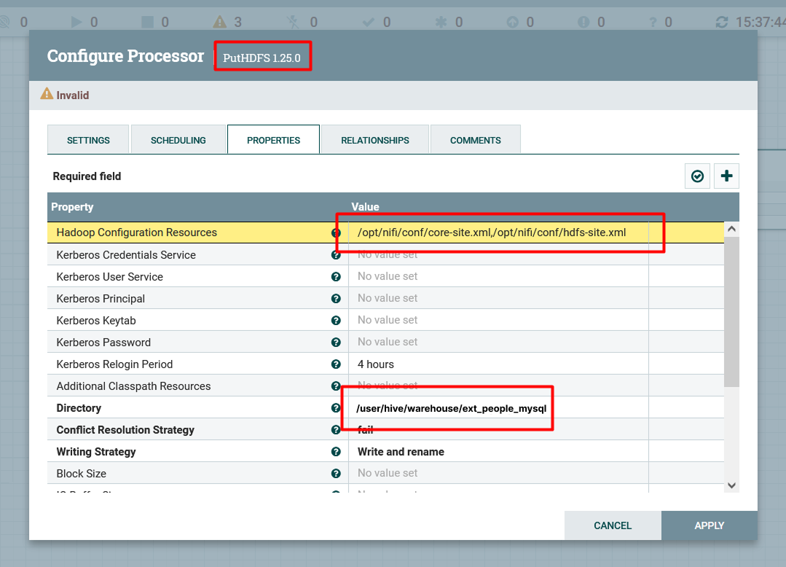

- Relier les trois processeurs

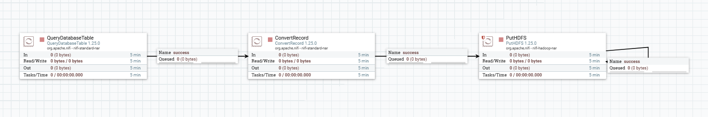

- Configurer `ConvertRecord` et `PutHDFS` pour qu'ils soient `valid`. Aller dans `Relashionships` et choisissez `terminate` pour `failure` pour les deux.

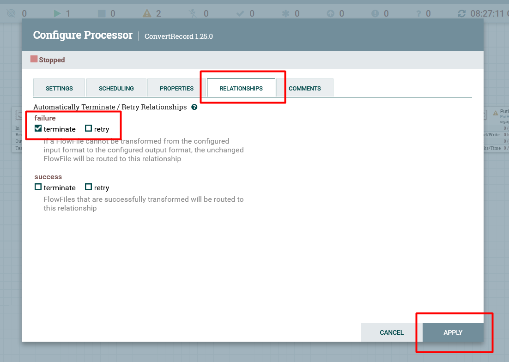

- Click droit sur le canvas puis `Start`

### Retour dans la VM - Verification

- Lister si le dossier `ext_people_mysql` a ete crée par nifi
```
hdfs dfs -ls /user/hive/warehouse/ext_people_mysql
```

- vous devrier voir une ligne comme ceci :
```
-rw-r--r--   1 vagrant supergroup        101 2025-06-01 15:47 /user/hive/warehouse/ext_people_mysql/b7591f3c-3450-49e9-a031-ba7c7c7bb3cb
```

- prendre le nom du fichier dans `ext_people_mysql` et lire son contenu
```
hdfs dfs -cat /user/hive/warehouse/ext_people_mysql/b7591f3c-3450-49e9-a031-ba7c7c7bb3cb
```
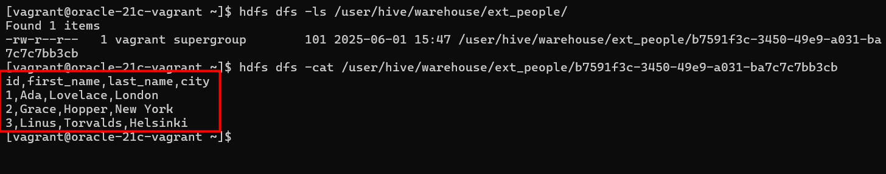

- Si vous avez le meme output que sur l'image c'est OK pour la partie MySQL -> Nifi -> Hive

Toutes mes Felicitations.

## This is the tandremo
#### Pour que le flow Nifi renvoie des données.
- Click droit sur le processor `QueryDatabaseTable` -> `View state` -> `Clear state`
- Le processor enregistre la derniere valeur maximum de la colonne `id` pour ne par renvoyer des lignes deja envoyées *(pas important dans notre cas)*.
- Ou juste inseré une nouvelle ligne dans `mysql>`.

## PARITE TENA IZY
>TO DO